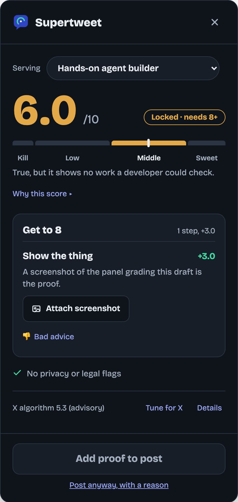
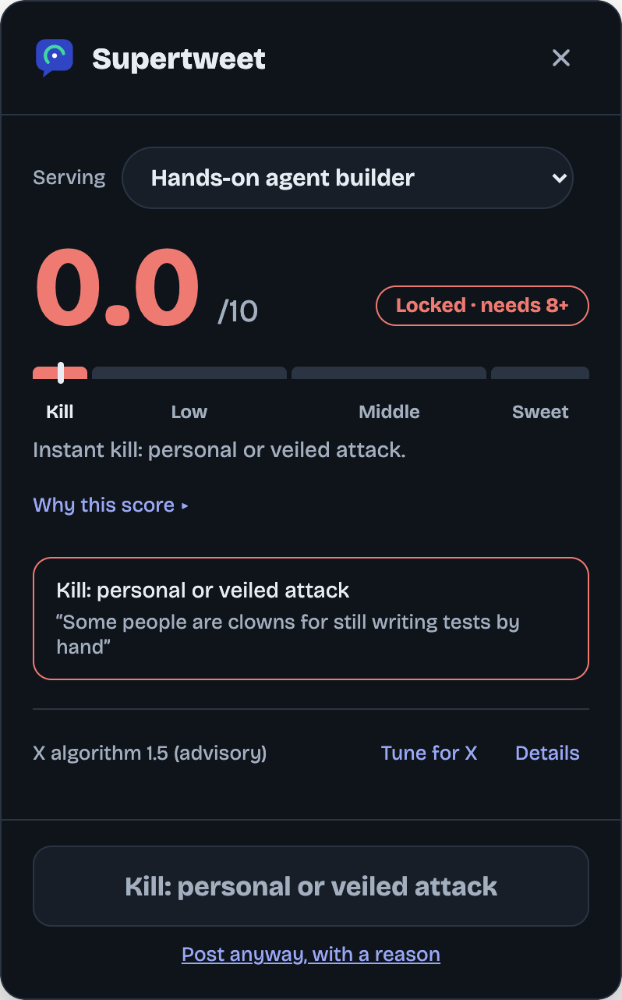
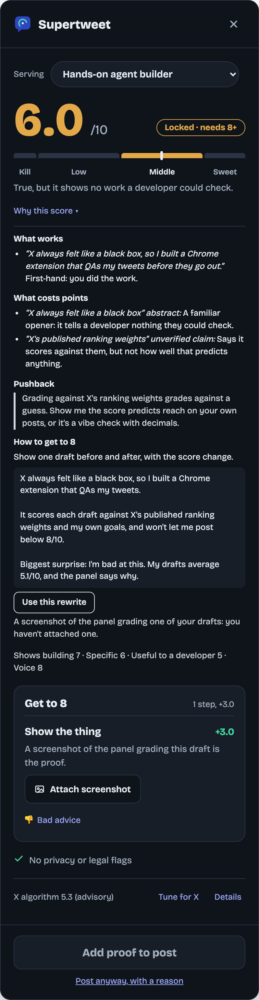
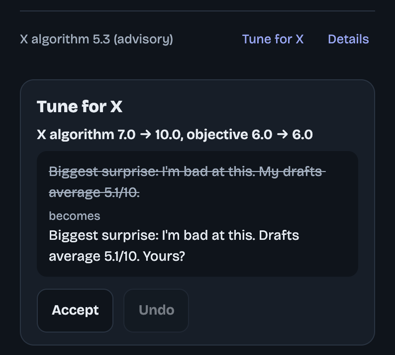
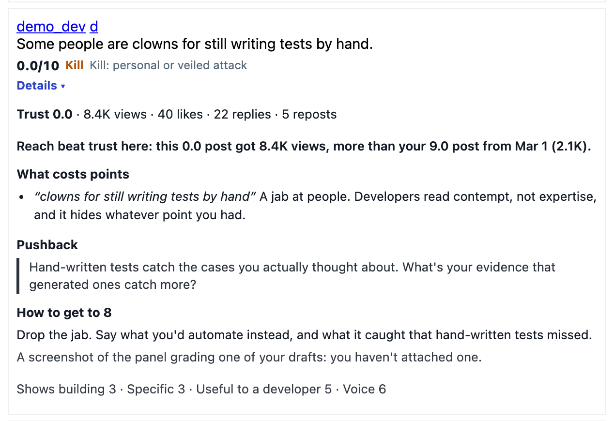

# Supertweet

**A browser extension that grades your X and LinkedIn drafts before they go live, and won't let you post until the draft earns it.**

Every draft is scored with the **Developer Trust filter**: *would a developer trust you with a real problem?* 0-10. Post unlocks at **8.0 or above**. Under the score you get at most two concrete steps to get there, a one-pass **Tune for X**, privacy checks on every keystroke, and a critique of each of your past posts.

Works in Chrome, Brave and Edge. The full guide is in [docs/GUIDE.md](docs/GUIDE.md).

<p align="center">
  
</p>

---

## Contents

- [What it does](#what-it-does)
- [Install](#install)
- [Connect a grader](#connect-a-grader)
- [How to use it](#how-to-use-it)
- [Screenshots](#screenshots)
- [Build from source](#build-from-source)
- [Privacy](#privacy)
- [Development and tests](#development-and-tests)

## What it does

| | |
| --- | --- |
| **One score** | The Developer Trust filter, 0-10, in four buckets: **Kill** (0: personal attacks, drugs or sex, politics, cynical looping, repeating yourself, emotion-only hype), **Low** (<4: hype, vague futurism), **Middle** (4-7: true but trite), **Sweet** (8-10: specific learnings from building, tools and skills a developer can use). |
| **A send gate** | X's and LinkedIn's own Post buttons are hidden. The panel's Post button is the only way to send, and it unlocks at 8.0. A typed, logged reason ("Post anyway") can get past a low score or a kill; nothing gets past contact info, your private terms or engagement bait. |
| **Get to 8** | At most two steps, each worth 1.0+: attach proof, answer a question only you can answer (skippable), or a one-line edit. Every edit must beat your original in a side-by-side check and keep your voice. Nothing worth suggesting? It says "Ready as written". |
| **Tune for X** | One pass aimed at what X's ranker rewards, with both scores shown before anything changes. Edits that would lower your trust score or invent a fact are dropped. |
| **Privacy checks** | On your device, on every keystroke: contact info, addresses, your private terms, legal matters, job search, money, health, family, heat of the moment. |
| **Past posts** | Every post of yours gets a score, a bucket and a one-line why. **Details** expands a critique: what works, what costs points, the pushback a skeptical senior developer would post, a fact-checked rewrite, and reach versus trust. |

## Install

**From a release (no build needed)**

1. Download `supertweet.zip` from the [latest release](https://github.com/Verafyai/supertweet-extension/releases/latest) and unzip it.
2. Open `chrome://extensions` (Brave: `brave://extensions`, Edge: `edge://extensions`).
3. Turn on **Developer mode** (top right).
4. Click **Load unpacked** and choose the unzipped folder.
5. Pin Supertweet from the puzzle-piece menu.

**From source:** see [Build from source](#build-from-source).

## Connect a grader

The extension never calls a model itself; it sends drafts (with private terms and contact info masked) to a grader you choose.

**Run your own (recommended).** You need Node.js 22+ and an [Anthropic API key](https://console.anthropic.com/).

```bash
git clone https://github.com/Verafyai/supertweet-extension.git
cd supertweet-extension
npm install
export ANTHROPIC_API_KEY=sk-ant-...   # yours; never commit it
npm run server                        # http://127.0.0.1:8787
```

Then open the extension popup → **Advanced** → **Grader** and enter `http://127.0.0.1:8787`. The popup turns green: "Local grader running".

The local server listens on 127.0.0.1 only and accepts requests only from the extension, never from web pages.

**Hosted grader (invite-only).** The extension's default grader is the Supertweet web app, which only allowlisted X accounts can use. If you're on the list, sign in at <https://supertweet-plum.vercel.app> and the extension links itself.

**Cost.** Grading only runs when you press **Grade**. One grade is three model calls (the score is their median) plus one comparison per suggested edit; the same draft is never graded twice.

## How to use it

1. **Write.** Start a post on x.com or linkedin.com. The Supertweet bubble appears beside the composer; click it to open the panel. It docks next to your draft so the text is never covered.
2. **Grade.** Press **Grade** (or ⌘/Ctrl+Enter in the composer). You get the score, the bucket bar, one line on why, and **Why this score ▸** for the full critique.
3. **Get to 8.** Work through the steps. **Attach screenshot** opens the site's own image picker; **Apply edit** changes one line and keeps every line break; **Skip, I don't have this** removes a question without changing the score; **👎 Bad advice** removes a step and teaches the grader not to suggest it again. Every change can be undone.
4. **Re-grade** after you edit. The score belongs to the exact draft.
5. **Optional: Tune for X.** One pass for X's ranker; you see "X algorithm 5.3 → 7.8, objective 6.0 → 6.0" and a line-by-line diff, then **Accept** or **Undo**. **Details** lists up to three specific fixes for the X algorithm, with a **Fix** button each, plus exactly when to post to avoid the author-diversity penalty.
6. **Post.** At 8.0+ the panel's **Post to X** / **Post to LinkedIn** clicks the site's own button for you and confirms it went out.
7. **Review past posts.** Scroll your profile: each post has a badge. **Details ▸** opens the critique. On your profile's *Posts & replies* tab, **Supertweet history** lists everything worst first; each post has its own **Delete…**, confirmed for that post, never in bulk.

Settings live in the popup (grader URL, LinkedIn slug, your other X handles) and the options page (who you write for, private terms, X algorithm sync).

## Screenshots

**A kill: the category, the words that triggered it, and the only way past it.**



**Why this score: what works, what costs points, the pushback, and a rewrite that only uses facts from your post.**



**Tune for X: both scores before anything changes.**



**Past posts: reach versus trust.**



*Screenshots come from the test fixtures with a mock model (`node scripts/screenshots.mjs`), so the critique text is illustrative.*

## Build from source

```bash
git clone https://github.com/Verafyai/supertweet-extension.git
cd supertweet-extension
npm install
npm run package     # dist/pkg (load this) and dist/supertweet.zip
```

There's no compile step; the extension is plain JavaScript. You can also load the repo folder itself with **Load unpacked** while you work. After pulling changes, click **reload** on the extension's card and refresh your X and LinkedIn tabs.

## Privacy

- It never posts, likes, follows or deletes on its own. Every send and every delete starts with your click.
- Private terms and contact info are masked before a draft leaves your browser. Private terms are stored only in your browser.
- No passwords or API keys are stored by the extension. A local grader keeps your API key in your shell; the hosted grader uses a signed token.
- Content scripts make no network calls. Only the background worker talks to your chosen grader, plus a weekly read of X's published algorithm on GitHub.

## Development and tests

```text
src/            content scripts, background worker, the score panel, shared rules
src/adapters/   X and LinkedIn DOM adapters (LinkedIn selectors in linkedin.selectors.js)
config/         objectives.json (an example: who you write for), x-algorithm-rules.json, grader-prompt.md
server/         the grading pipeline and the local grader server
test/           unit tests and headless-Chrome end-to-end tests (mock model, no API key)
docs/           the guide, screenshots, and the score panel's reference design
```

```bash
npm test             # everything (end-to-end suites need Google Chrome installed)
npm run test:unit    # unit tests only
```

`config/objectives.json` ships as an example. Edit it in the extension's options page to describe who you write for.

The panel font is [Bricolage Grotesque](https://github.com/ateliertriay/bricolage) (SIL Open Font License, `fonts/OFL.txt`).
